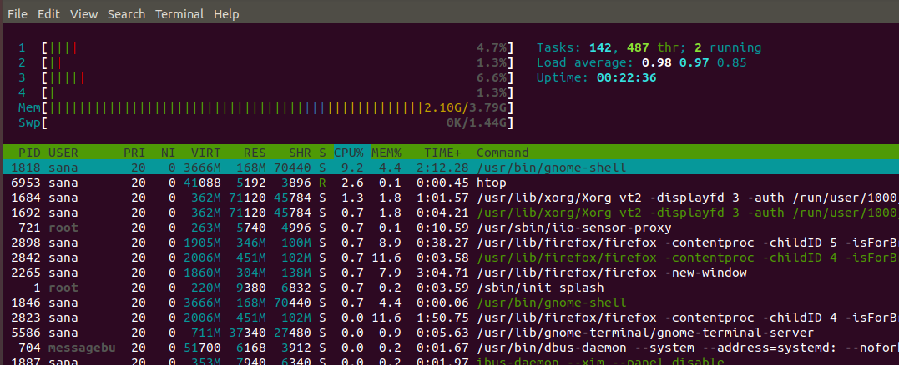

# How to check system resources

There are alternatives mentioned at https://vitux.com/5-ways-to-check-available-memory-in-ubuntu/

I like htop the most:

    sudo apt-get update
    sudo apt install htop
    htop

