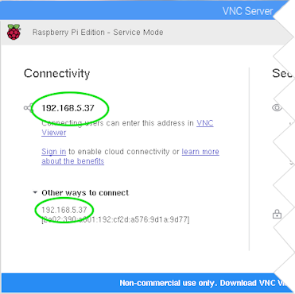
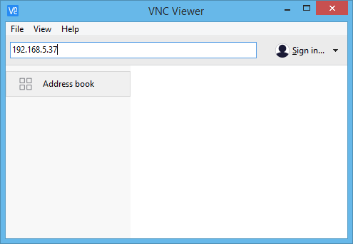

# How To Setup RealVNC on the raspberry pi

In-depth details can be found at https://help.realvnc.com/hc/en-us/articles/360002249917-VNC-Connect-and-Raspberry-Pi#setting-up-your-raspberry-pi-0-0

## Basics
1. Ensure that vnc server is installed with

    ```
    sudo apt-get update
    sudo apt-get install realvnc-vnc-server
    ```
1. Enable with the raspi-config menu
    * Menu > Preferences > Raspberry Pi
    * Configuration > Interfaces
    * make sure VNC is set to Enabled
    * From now on, VNC Server will start automatically every time you boot your Raspberry Pi
1. Connecting
    * if on a local network then a direct connection may be secure enough
        1. On your Raspberry Pi, discover its private IP address by double-clicking the VNC Server icon on the taskbar and examining the status dialog:

            

        1. On the device you will use to take control, run VNC Viewer and enter the IP address in the search bar:

            
    * if going through the global internet, then it is safer to use the RealVNC cloud connection through the VNC gui (see link above for details)


## Terminal Shortcuts and commands
Common commands for Raspbian Jessie (which is based on Debian 8, and uses systemd) are:

* To start VNC Server now:

        sudo systemctl start vncserver-x11-serviced.service
* To start VNC Server at next boot, and every subsequent boot:

        sudo systemctl enable vncserver-x11-serviced.service
* To stop VNC Server:

        sudo systemctl stop vncserver-x11-serviced.service
* To prevent VNC Server starting at boot:

        sudo systemctl disable vncserver-x11-serviced.service
